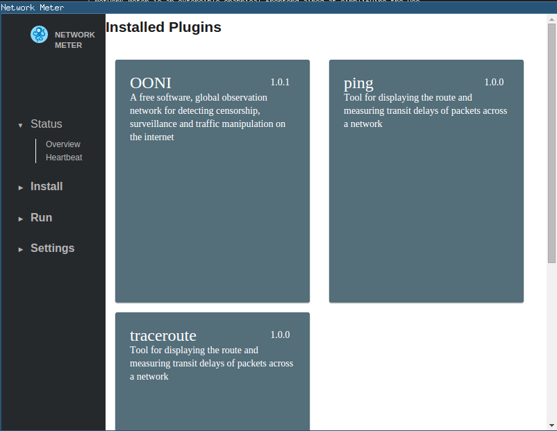

Network Meter
============
Network Meter is an extensible graphical frontend aimed at simplifying the use
of network diagnostic tools. Developed with Electron, Node.js and Ractive, 
Network Meter is still in very early alpha.

We aspire not only to provide the user with an easy-to-use interface, but also
to visualize and present the data outputed in a meaningful manner.

# To build and run

```
npm install -d
npm install
npm start
```

# Screenshot

